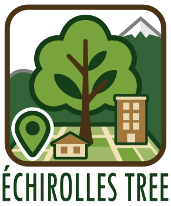
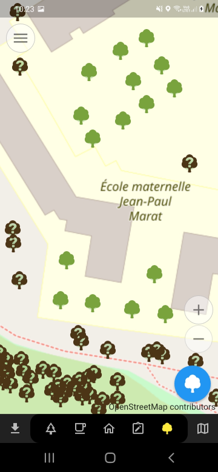
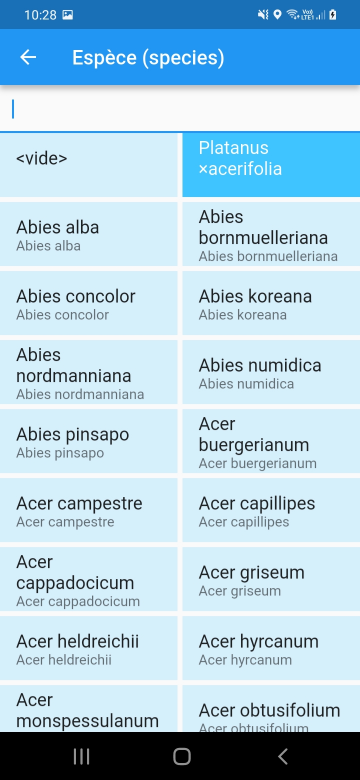
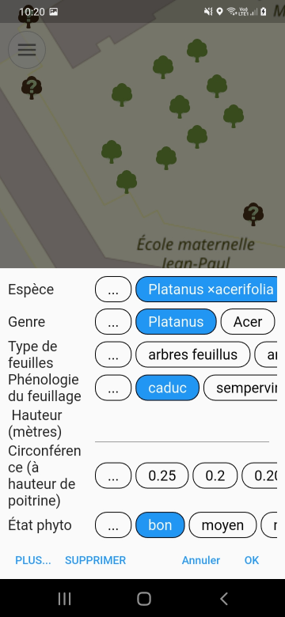

# 🌳 Échirolles Tree 🌲

A plugin for `Every Door` to contribute 🌳 **trees** from Échirolles city in OpenStreetMap.



## ⭐ Features

### 👀 Quick survey of tree species

- Trees with known species are green
- Others are in brown



### Tree species presets adapted of the "Échirolles" context

The plugin provides a set of already known identified species and species that are planned to be planted in order to help you tag tree species in Échirolles and nearby.



### New `health:phyto_status` tag proposal
This proposal aims to get information from the field to warn owners of sanitary health of their trees. More informations are available on a the [Wiki page](https://wiki.openstreetmap.org/wiki/Echirolles/Suivi_arbres) (in french) dedicated to our tree referential  



## 🛠️ How to create the plugin file

### Using bash

```bash
# Remove old files
rm -f echirolles-tree.edp
# Create the classic plugin
zip -r echirolles-tree.edp icons/ langs/ LICENSE plugin.yaml
rm -rf tmp-edp
```

### Using PowerShell

```powershell
Remove-Item .\echirolles-tree.edp
Compress-Archive -Path icons, langs, LICENSE, plugin.yaml, README.md -DestinationPath echirolles-tree.edp
```

## 📥 How to install the plugin

📲 Scan this QR code with `Every Door` version **6 or later**:


Or [⬇️ download the plugin here](https://raw.githubusercontent.com/sig-echirolles/every-tree/refs/heads/main/echirolles-tree.edp).

[🔍 More information on installation](https://every-door.app/plugins/install/).

## 🌱 About

`echirolles-tree` is a fork of the [every-tree](https://github.com/Binnette/every-tree) plugin, created by [Binnette](https://github.com/Binnette/). Thanks to him!