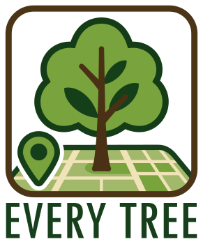

# 🌳 Every Tree 🌲

A plugin for `Every Door` to contribute 🌳 **trees** in OpenStreetMap.



## 🛠️ How to create the plugin file

### Using bash

```bash
zip -r every-tree.edp icons/ langs/ LICENSE plugin.yaml README.md
```

### Using PowerShell

```powershell
Compress-Archive -Path icons/*, langs/*, LICENSE, plugin.yaml, README.md -DestinationPath every-tree.edp
```

## 📥 How to install the plugin

📲 Scan this QR code with `Every Door` version **6 or later**:


Or [⬇️ download the plugin here](https://raw.githubusercontent.com/Binnette/every-tree/refs/heads/main/every-tree.edp).

[🔍 More information on installation](https://every-door.app/plugins/install/).

## 📝 Todo list
- [ ] Ask all my questions to Ilya.
- [ ] Draw custom icons for each tree species.
