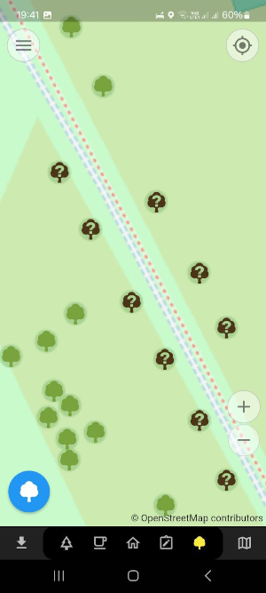
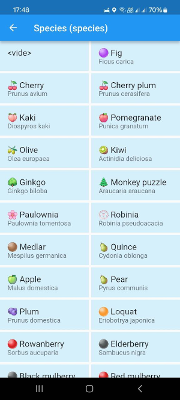

# 🌳 Every Tree 🌲

A plugin for `Every Door` to contribute 🌳 **trees** in OpenStreetMap.


## ⭐ Features

### 👀 Quick survey of tree species

- Trees with known species are green
- Others are in brown



### Tree species presets adapted of the Echirolles' context

The plugin provides a set of already known identified species and species that are planned to be planted in order to help you tag tree species in Echirolles and nearby.



## 🛠️ How to create the plugin file

### Using bash

```bash
# Remove old files
rm -f every-tree-echirolles.edp
# Create the classic plugin
zip -r every-tree-echirolles.edp icons/ langs/ LICENSE plugin.yaml
rm -rf tmp-edp
```

### Using PowerShell

```powershell
Compress-Archive -Path icons/*, langs/*, LICENSE, plugin.yaml, README.md -DestinationPath every-tree-echirolles.edp
```

## 📥 How to install the plugin

📲 Scan this QR code with `Every Door` version **6 or later**:


Or [⬇️ download the plugin here](https://raw.githubusercontent.com/sig-echirolles/every-tree/refs/heads/main/every-tree-echirolles.edp).

[🔍 More information on installation](https://every-door.app/plugins/install/).
